  

  <h3>Building scalable data pipelines, intelligent AI systems & developer tools.</h3>
  
  
  
  

 

### About Me

I am a **Senior Software Engineer** with **8+ years of experience** building production-grade data pipelines and analytics solutions. Currently, I am finishing my **M.S. in Computer Science (AI/ML Specialization)** at SUNY Binghamton.

I bridge the gap between **complex data infrastructure**, **advanced ML models**, and **system security**.

* 🔭 I’m currently working on **Firefox Ecosystem Tools** and **Generative AI**.
* 🏭 Previously, I led data architecture initiatives at **Schneider Electric**.
* 🔐 **Security Focus:** I am expanding my data engineering roots into **Cybersecurity** to build safer AI systems.
* ⚡ **Fun Fact:** I build tools in **Rust** for performance and **JavaScript** for productivity.

---

### Tech Stack & Tools

| **Core Languages** | **AI & Machine Learning** | **Big Data & Cloud** | **Web & Extensions** |
|:---:|:---:|:---:|:---:|
|        |        |        |        |

---

### Featured Projects

| Project | Tech Stack | Description |
| :--- | :--- | :--- |
| **Hashassin** | `Rust` `Tokio` `Distributed Systems` | A distributed password recovery platform featuring a custom TLV binary protocol and thread-safe state management.    |
| **Multimodal Misinformation Detection** | `TensorFlow` `NLP` `CV` | A pipeline using NLP and computer vision to detect misinformation across media formats.    |
| **Epoch Focus** | `JavaScript` `Firefox Extension` | A minimalist new tab extension designed to improve focus and productivity.     |
| **Epoch Light** | `CSS` `Theme` | A clean, distraction-free light theme for Firefox.     |

---

### GitHub Stats

  

---

### 📜 Active Certification Goals

* **Google Cybersecurity Certificate** – Coursera
* **Google Advanced Data Analytics Certificate** – Coursera
* **DP-700: Azure Data Solutions** – Microsoft
* **Google Project Management Certificate** – Coursera

---

### Publications & Research

* **Estimating torque-speed characteristic of three-phase induction motor operating under unbalance supply.**
    * *IEEE Xplore, 2013 NUICONE* | [Read Paper](https://ieeexplore.ieee.org/document/6780144)

---

  <small>Check out my blog at <a href="https://thecsjourney.com">thecsjourney.com</a></small>

---

### 🕹️ Side Quest: A Completionist Journey

I am a passionate tech enthusiast and an aspiring gaming "completionist." I believe the best way to understand complex systems and design patterns is to experience every edge case.

* 🏆 **Goal:** 100% completion of the majority of games I play.
* 📈 **Data Tracking:** I maintain a detailed log of completion stats and mechanics analysis.
* 👾 **Tech Interest:** Exploring game engines and low-level systems programming in my free time.

Check out my full tracking list and reviews on [thecsjourney.com](https://www.thecsjourney.com).